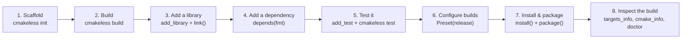

# Tutorial: Your First CMakeless Project

A guided walkthrough from an empty directory to a tested, linked, dependency-using project that
builds in Release, installs, and packages. Every command in this page was run for real while
writing it, on Windows, against a real compiler and a real network; the CMake it prints and the
files it generates are copied verbatim, not reconstructed from memory. Nothing here is
Windows-specific: the same commands run unchanged on Linux and macOS.



## Prerequisites

You need three things on `PATH`, none of them CMakeless-specific:

- **Python 3.12 or newer.** Check with `python --version`.
- **CMake 3.25 or newer.** Check with `cmake --version`.
- **A C++ compiler** CMake already knows about (MSVC, GCC, or Clang). A generator
  (Ninja is picked automatically when present, otherwise CMake's platform default) does the rest.

`ccache`/`sccache`, `vcpkg`, and `conan` are all optional and auto-detected when present; nothing
below requires any of them. If you are unsure what your machine has, skip to
[Step 8](#step-8-inspect-the-build-and-diagnose-the-machine), which covers `cmakeless doctor`, the
command designed to answer exactly that question.

## Step 1: Install and scaffold

```console
$ pip install cmakeless
$ mkdir tutorial && cd tutorial
$ cmakeless init
[cmakeless] Scaffolded project 'tutorial' in /path/to/tutorial
[cmakeless] Next: run 'cmakeless build' (or 'python cmakelessfile.py'), then ./build/tutorial
```

`cmakeless init` writes three files: a minimal `cmakelessfile.py`, a `src/main.cpp`, and a
`.gitignore` that already excludes the generated `CMakeLists.txt`, `CMakePresets.json`, and
`build/` (the tip at the end of [Step 2](#step-2-build-it-and-read-what-it-generated) below covers
why those are ignored by default). Open `cmakelessfile.py`: it is five lines, and it is the whole
build.

```python
# cmakelessfile.py
from cmakeless import Project

project = Project("tutorial", version="1.0.0", cpp_std=20)
project.add_executable("tutorial", sources=["src/main.cpp"])
project.build()
```

## Step 2: Build it, and read what it generated

```console
$ cmakeless build
[cmakeless] Running configure: "cmake" -S . -B build -G Ninja -DCMAKE_EXPORT_COMPILE_COMMANDS=ON ...
-- The CXX compiler identification is ...
-- Configuring done
-- Generating done
-- Build files have been written to: .../tutorial/build
[cmakeless] Running build: "cmake" --build build
[1/2] Building CXX object CMakeFiles/tutorial.dir/src/main.cpp.obj
[2/2] Linking CXX executable tutorial.exe
```

That command generated a `CMakeLists.txt`, configured it, and compiled a real binary, all from the
five lines above. Here is the file it wrote, byte for byte:

```cmake
# Generated by cmakeless 0.5.5 from cmakelessfile.py.
# This file is standalone: it builds with plain CMake, no Python needed.
# Prefer editing cmakelessfile.py and regenerating over editing this file.

cmake_minimum_required(VERSION 3.25)

project(tutorial
    VERSION 1.0.0
    LANGUAGES CXX
)

set(CMAKELESS_SYSTEM_NAME "${CMAKE_SYSTEM_NAME}" CACHE INTERNAL "")
set(CMAKELESS_SYSTEM_PROCESSOR "${CMAKE_SYSTEM_PROCESSOR}" CACHE INTERNAL "")

add_executable(tutorial)

target_sources(tutorial PRIVATE
    src/main.cpp
)

target_compile_features(tutorial PRIVATE cxx_std_20)
```

Notice the promise from [ARCHITECTURE](ARCHITECTURE.md#what-the-emitter-must-guarantee) made concrete:
target-centric (`target_compile_features`, not a directory-level `set(CMAKE_CXX_STANDARD ...)`),
self-describing (the header comment names the version and the source file), and short enough to
read in five seconds. Run your binary:

```console
$ ./build/tutorial
Hello from cmakeless!
```

!!! tip "Should I commit the generated CMakeLists.txt?"
    `cmakeless init`'s `.gitignore` says no by default, treating it like any other build artifact:
    `cmakelessfile.py` is the source of truth, and regenerating is free. Committing the generated
    file too is also a legitimate choice, since it is deterministic and diffable; some teams like
    having it reviewable in the same pull request as the Python that produced it. Either way, never
    hand-edit it: the header comment says so, and your edits disappear on the next build.

## Step 3: Add a library

Real projects split code into a library and an entry point. Add one:

```console
$ mkdir -p src/engine include
```

```cpp
// include/engine.hpp
#pragma once
auto greeting() -> const char*;
```

```cpp
// src/engine/engine.cpp
#include "engine.hpp"
auto greeting() -> const char* { return "Hello from the engine"; }
```

Update `cmakelessfile.py`:

```python
from cmakeless import Project

project = Project("tutorial", version="1.0.0", cpp_std=20)

engine = project.add_library(
    "engine",
    sources=["src/engine/*.cpp"],
    public_headers="include/",
)

app = project.add_executable("tutorial", sources=["src/main.cpp"])
app.link(engine)

project.build()
```

`app.link(engine)` links privately by default, the right call for an executable: nothing that
links `tutorial` in turn needs to know it happens to use `engine`. No `PUBLIC`/`PRIVATE`/`INTERFACE`
to memorize; the one time visibility does matter is library-to-library linking, covered in
[Add an include directory](cookbook.md#add-an-include-directory-and-a-private-include-directory) and
[Link one library into another with the right visibility](cookbook.md#link-one-library-into-another-with-the-right-visibility).

Update `src/main.cpp` to use it:

```cpp
// src/main.cpp
#include "engine.hpp"
#include <iostream>

auto main() -> int {
    std::cout << greeting() << "\n";
    return 0;
}
```

```console
$ cmakeless build
[1/4] Building CXX object CMakeFiles/engine.dir/src/engine/engine.cpp.obj
[2/4] Linking CXX static library engine.lib
[3/4] Building CXX object CMakeFiles/tutorial.dir/src/main.cpp.obj
[4/4] Linking CXX executable tutorial.exe
$ ./build/tutorial
Hello from the engine
```

The relevant slice of the regenerated `CMakeLists.txt`, again unedited:

```cmake
add_library(engine STATIC)

target_sources(engine PRIVATE
    src/engine/engine.cpp
)

target_include_directories(engine PUBLIC
    $<BUILD_INTERFACE:${CMAKE_CURRENT_SOURCE_DIR}/include>
)

target_compile_features(engine PUBLIC cxx_std_20)

set_target_properties(engine PROPERTIES POSITION_INDEPENDENT_CODE ON)

add_executable(tutorial)
...
target_link_libraries(tutorial
    PRIVATE engine
)
```

`public_headers="include/"` became a `$<BUILD_INTERFACE:...>` generator expression automatically
(the matching `$<INSTALL_INTERFACE:...>` arrives the moment you call [`project.install(engine, headers=True)`](#step-7-install-and-package-a-release)),
and `POSITION_INDEPENDENT_CODE` is set even for a static library, because it might end up linked
into a shared one later. Neither is a line you had to know to write.

## Step 4: Add a dependency

Depend on a real third-party library in one line:

```python
app.depends("fmt/10.2.1")
```

```console
$ cmakeless build
-- Version: 10.2.1
[1/5] Building CXX object CMakeFiles/tutorial.dir/src/main.cpp.obj
[2/5] Building CXX object _deps/fmt-build/CMakeFiles/fmt.dir/src/format.cc.obj
[3/5] Building CXX object _deps/fmt-build/CMakeFiles/fmt.dir/src/os.cc.obj
[4/5] Linking CXX static library _deps/fmt-build/fmtd.lib
[5/5] Linking CXX executable tutorial.exe
```

`cmakeless build` resolved it (`find_package` first, then `FetchContent` if not found on the
system, as diagrammed in [FEATURES](FEATURES.md#2-dependencies-one-line-any-backend)), pinned the
exact version in `cmakeless.lock`, and linked the correct target (`fmt::fmt`, not `fmt`)
automatically. `cmakeless.lock` now records exactly what got fetched:

```json
{
  "packages": {
    "fmt": {
      "backend": "auto",
      "cmake_name": "fmt",
      "sha256": "1250e4cc58bf06ee631567523f48848dc4596133e163f02615c97f78bab6c811",
      "targets": ["fmt::fmt"],
      "url": "https://github.com/fmtlib/fmt/archive/refs/tags/10.2.1.tar.gz",
      "version": "10.2.1"
    }
  },
  "schema": 1,
  "vcpkg": { "baseline": null }
}
```

Commit `cmakeless.lock`. It is what makes "works on my machine" reproducible: a teammate or CI
machine running `cmakeless build` against the same lockfile fetches the identical archive, verified
against the identical hash, regardless of what else is installed on that machine.

!!! note "Nothing else changes"
    `app.depends(...)` is the entire diff. No `FetchContent_Declare`, no remembering that the
    CMake target is `fmt::fmt` and not `fmt`, no `find_package`-or-fetch fallback to hand-write.

## Step 5: Test it

```python
tests = project.add_test("engine_tests", sources=["tests/*.cpp"])  # GoogleTest by default
tests.link(engine)
```

```cpp
// tests/engine_tests.cpp
#include "engine.hpp"
#include <gtest/gtest.h>

TEST(Engine, GreetingIsNotEmpty) {
    EXPECT_STRNE(greeting(), "");
}
```

```console
$ cmakeless test
[cmakeless] Running test: "ctest" --test-dir build --output-on-failure
Test project .../tutorial/build
    Start 1: Engine.GreetingIsNotEmpty
1/1 Test #1: Engine.GreetingIsNotEmpty ........   Passed    0.06 sec

100% tests passed out of 1
```

CMakeless fetched GoogleTest, registered the test case with CTest via `gtest_discover_tests` (so
each `TEST(...)` shows up as its own CTest entry, not one lump per binary), and ran it. Prefer
Catch2 or doctest? Pass `framework="catch2"` or `framework="doctest"` instead; `framework="none"`
gets you a plain executable whose exit code is the verdict, for hand-rolled test runners.

Want to know your code is clean under a sanitizer too? No changes to `cmakelessfile.py` required:

```console
$ cmakeless test --sanitize=address
```

This configures and builds a *separate* build tree with the sanitizer applied to compile and link,
so your normal `build/` tree is untouched. See
[Run a sanitized test suite](cookbook.md#run-a-sanitized-test-suite) for combining sanitizers or
wiring one into a preset permanently.

## Step 6: Configure builds with presets

So far every build has landed in the same `build/` directory with CMake's default settings. Real
projects need at least a Debug and a Release configuration, usually more. Declare them as
`Preset`s instead of remembering `-DCMAKE_BUILD_TYPE=` and a separate directory yourself:

```python
from cmakeless import Preset

project.add_preset(Preset("release", optimize="release", lto=True))
```

```console
$ cmakeless build --preset release
-- Build type: Release
[cmakeless] Running build: "cmake" --build build/release
```

Each preset gets its own out-of-source build directory (`build/release/` here), so Debug and
Release artifacts never collide, and CMakeless also wrote a `CMakePresets.json` alongside your
`CMakeLists.txt`: open the folder in CLion, Visual Studio, or VS Code's CMake Tools, and the
`release` configuration is already there, no IDE-specific setup needed. Add a `debug` preset the
same way (`Preset("debug", optimize="none", sanitize=["address"])`), or an `inherits=`-based `ci`
preset that overrides one option; see
[Cross-compile for ARM](cookbook.md#cross-compile-for-arm) for combining a preset with a
`Toolchain`.

## Step 7: Install and package a release

A release your teammates (or CI, or a package manager) can consume needs install rules and,
usually, an archive:

```python
project.install(engine, headers=True)
project.install(app)
project.package(formats=["zip"])
```

```console
$ cmakeless install --preset release --prefix dist
-- Installing: .../dist/include/engine.hpp
-- Installing: .../dist/bin/tutorial.exe
-- Installing: .../dist/lib/cmake/tutorial/tutorialConfig.cmake
-- Installing: .../dist/lib/cmake/tutorial/tutorialConfigVersion.cmake

$ cmakeless package --preset release
CPack: Create package using ZIP
CPack: - package: .../build/release/tutorial-1.0.0-win64.zip generated.
```

`project.install(engine, headers=True)` did not just copy `engine.lib`: it also wrote a
`tutorialConfig.cmake` and version file, so another CMake project can
`find_package(tutorial)` yours the same way `app.depends("fmt/10.2.1")` found `fmt` for you. That
symmetry, "the dependency mechanism you consume is the one you produce," is deliberate.

## Step 8: Inspect the build, and diagnose the machine

Two verbs answer "what did CMake actually decide?" without you parsing `CMakeCache.txt` by hand:

```python
info = project.cmake_info()
print(info.generator, info.system_name, info.system_processor)
for compiler in info.compilers:
    print(compiler.language, compiler.compiler_id, compiler.compiler_version)

for target in project.targets_info():
    print(target.name, target.type)
```

And a fourth command answers "what is missing on *this* machine", with no `cmakelessfile.py`
required at all:

```console
$ cmakeless doctor
[cmakeless] doctor
  cmake      ok     4.4.0 (>= 3.25 required)
  generator  ok     ninja
  ccache     ok     found at ...
  sccache    ok     found at ...
  vcpkg      missing not found on PATH (only needed for project.package_manager = "vcpkg")
  conan      ok     found at ...
  network    ok     reached https://github.com
```

Run this first on a new machine, in CI, or when a teammate reports "it builds for me": it is the
fastest way to rule the environment in or out before debugging your `cmakelessfile.py`.

## Reading a CMakeless error

Goal 2 in [ARCHITECTURE](ARCHITECTURE.md#design-goals) is "fail early, fail in Python", and this is
what that looks like in practice. Break the glob in step 3 on purpose (rename `src/engine/` without
updating `sources=`) and rebuild:

```console
$ cmakeless build
cmakeless: error: Source pattern 'src/engine/*.cpp' for target 'engine' matched no files
under .../tutorial. Check the pattern in cmakelessfile.py for a typo, or create the files.
```

No CMake was invoked; no fifty-line configure log to scroll through. The message names the file,
the target, and the fix, per the rule in
[ARCHITECTURE](ARCHITECTURE.md#error-handling-errors-are-a-feature): every CMakeless error states
what went wrong, where, and what to try next. `DependencyError`, `ToolchainError`, and `CMakeError`
follow the same shape; see the error hierarchy diagram there for the full picture, and
[Depend on a package outside the built-in registry](cookbook.md#depend-on-a-package-outside-the-built-in-registry)
for the exact wording `DependencyError` uses when a package name is unknown, and how to answer it.

## What you have

A library, an executable, a real external dependency, a test suite, a Release preset, install
rules, and a packaged archive, described in well under fifty lines of plain Python, with a
`CMakeLists.txt` you can commit, open in any IDE, or keep building with plain `cmake` if you ever
delete CMakeless entirely. That is the whole model: describe the build in Python, let CMakeless
generate and drive real CMake.

## Where next

- [Cookbook](cookbook.md): task-oriented recipes for everything you'll want next, organized the
  same way this tutorial built up, plus cross-compiling, custom build steps, a private dependency
  mirror, Python bindings, and CMake reflection.
- [Features](FEATURES.md): the complete feature catalog, with before/after CMake comparisons.
- [Migration guide](migration.md): bringing CMakeless into a project that already has a
  hand-written `CMakeLists.txt`, one target at a time.
- [Architecture](ARCHITECTURE.md): why the API is shaped this way, layer by layer.
